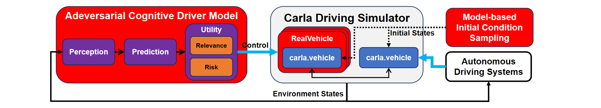
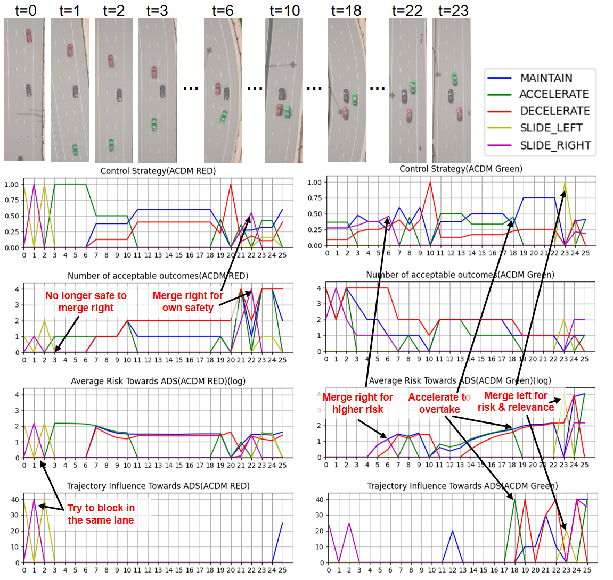

# Closed-Loop Testing of Autonomous Driving Systems: A Safety-Critical, Effective, and Realistic Evaluation Using the Adversarial Cognitive Driver Model


## Table of Contents
1. [Environment Setup](#environment-setup)
2. [Quickly Started](#quickly-started)
3. [Custom Scene Library](#custom-scene-library)
4. [Multi Process Mode](#multi-process-mode)
5. [Decision Example](#decision-example)
## Environment Setup
1. Clone the repository
```bash
git clone https://github.com/HCPS-ShanghaiTech/ACDM_open.git
cd ACDM_open
```
2. Create environment && Install the dependencies
```bash
conda create -n acdm python=3.10 # Need Python version >= 3.10
conda activate acdm
pip install -r requirement.txt
```
3. Download our Neural network weights at (TODO: Now set in the repository)
## Quickly Started
#### Experiment Scripts
1. Import submodule (needed for all d2rl experiment)
```bash
git submodule update --init
```
- The modified D2RL code: [d2rl-exp-for-ACDM](https://github.com/qj-hcps/d2rl-exp-for-ACDM)
- For D2RL
  - Paper: [Dense reinforcement learning for safety validation of autonomous vehicles](https://www.nature.com/articles/s41586-023-05732-2)
  - Code: [Dense-Deep-Reinforcement-Learning
](https://github.com/michigan-traffic-lab/Dense-Deep-Reinforcement-Learning?tab=readme-ov-file)
2. Run scripts
- For Windows
```bash
winscript/short_experiment.bat
winscript/long_experiment.bat
```
- For Linux
```bash
sh linuxscripts/short_experiment.sh
sh linuxscripts/long_experiment.sh
```
#### Preset Scene Library
1. Load carla world
```bash
python load_world.py
```
2. Preset scene example, `-s` for scene type in ["ttc", "action"], `-n` for npc controller in ["cdm", "acdm", "idm", "d2rl"], `-e` for ego controller in ["cdm", "idm"], `-d` for max duration(s) of single scene.
```bash
python main.py -t "short" -s "ttc" -n "acdm" -e "cdm" -d 10
```
## Custom Scene Library
The init scenes are saved in a `.csv` file.
#### Scene library input format
- First line save the number of cars: `n: int`
- Second line save the main car's information `(init_speed: double, driving_style: double, controller: str)`
- The next n-1 lines input each npc car's `(init_speed: double, lane_id: int, rel_pos: double, driving_style: double, controller: str)`
    - Where `lane_id` is 0 means at different lane from the main car, 1 means the same.
    - For controllers do not need `driving_style`, just miss it.

#### Run your custom scene
You can specify the file path (with higher priority than the preset scenes) like:
```bash
python main.py -t "short" -d 10 -p "path_for_your_csv_file"
```

## Multi Process Mode
For CDM and ACDM controller, the prediction module may cost high computational complexity in scenes with dense vehicular traffic (>= 8 cars in 50m around main car), so we have implemented a multi process optimization mode for CDM and ACDM controllers, for users with multi-core CPUs, you can add `-m` to accelerate simulation experiment.
(Hint: It is not recommended when there are few vehicles such as our 3 cars experiment.)
```bash
python main.py (-args ...) -m
```

## Decision Example
